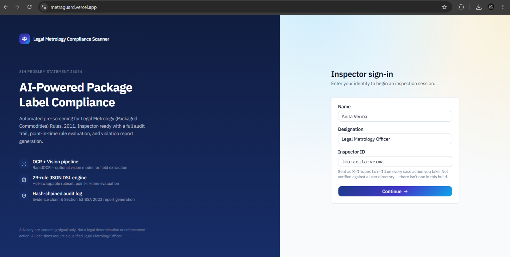
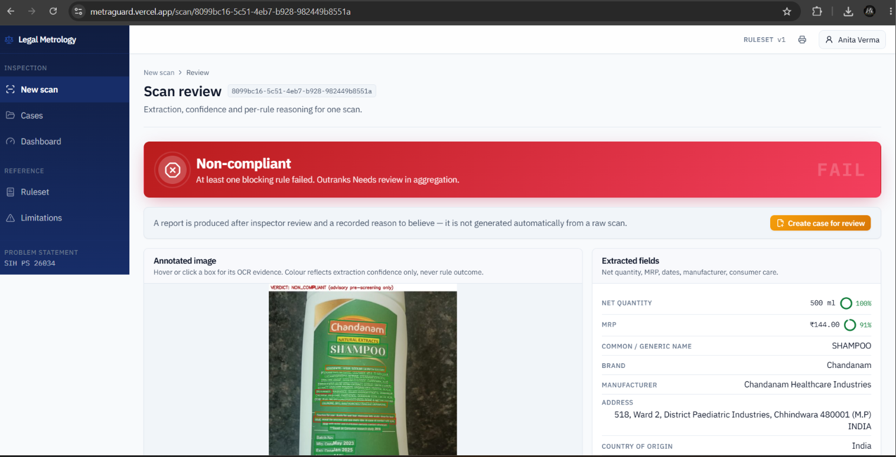
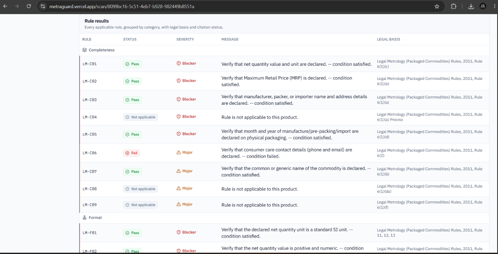
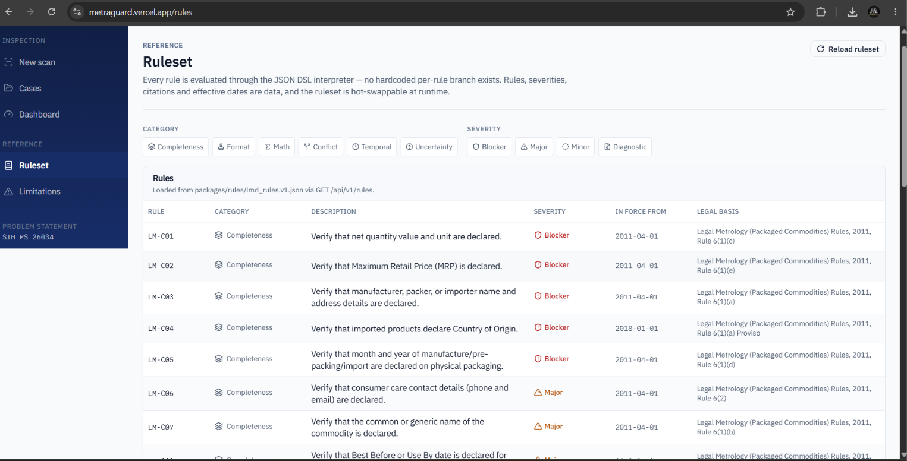
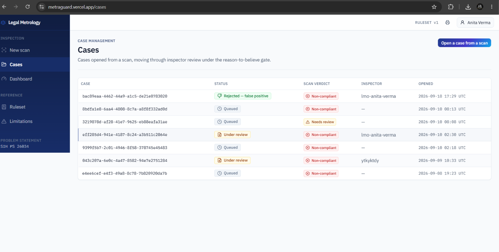
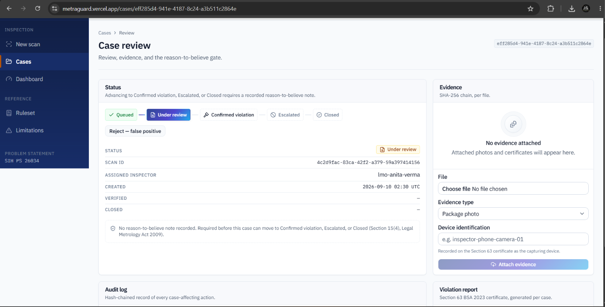
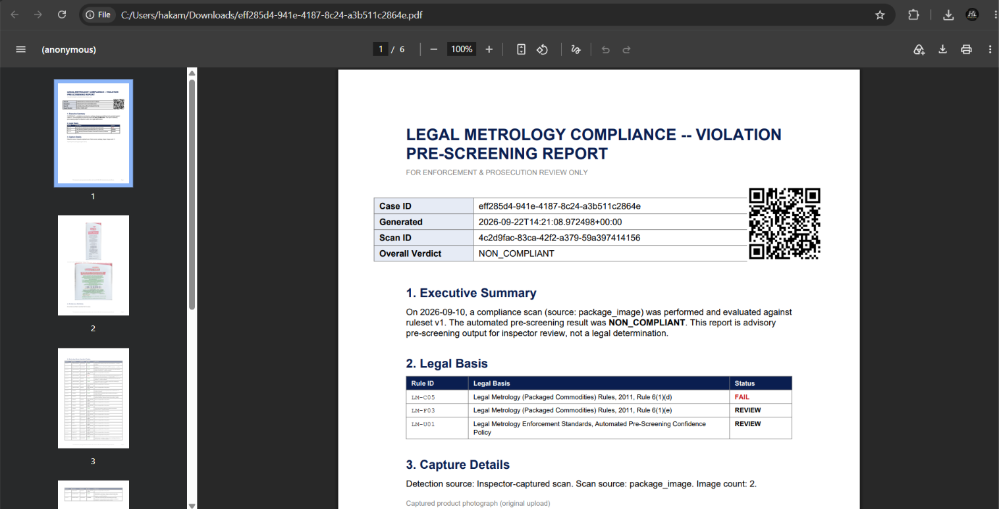
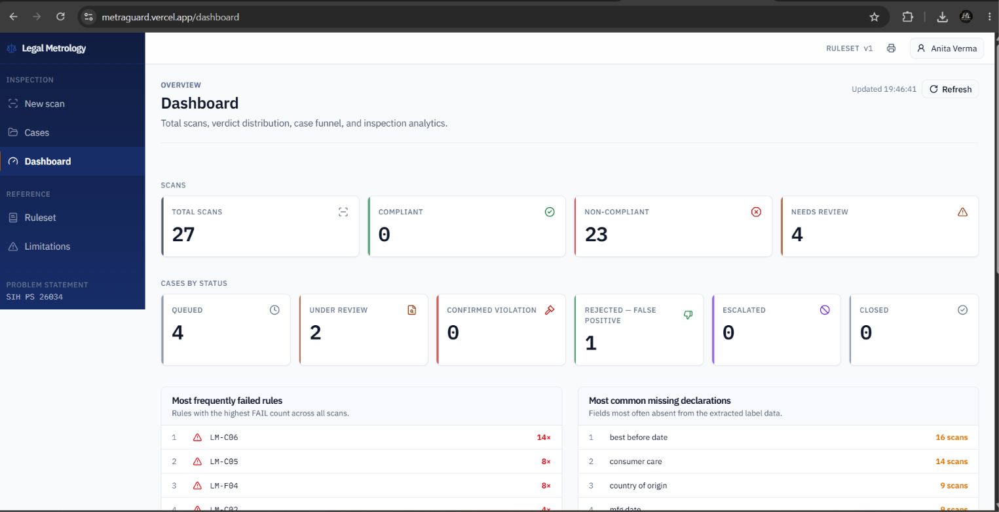
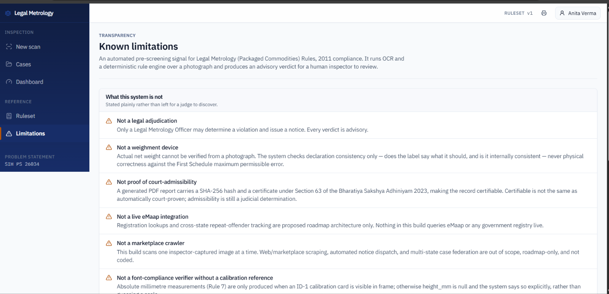

# Legal Metrology Compliance Scanner

**Smart India Hackathon — Problem Statement 26034**
*Software system to check compliance of packaged commodities under the
Legal Metrology (Packaged Commodities) Rules, 2011 by scanning products,
images and labels.*

[](backend)
[](frontend)
[](packages/rules)
[-0369a1)](backend/lmd/cv)
[](#)

A working end-to-end prototype: an inspector captures or uploads a photo of
a packaged commodity, two independent extraction pipelines read the label,
a transparent JSON-driven rule engine evaluates it against Legal Metrology
law, and the result is an annotated overlay, a per-rule verdict with exact
legal citations, and a signed, hash-chained PDF violation report — gated by
a mandatory "reason to believe" review step before any case can be escalated.

No mocked screens. No dead buttons. No fabricated numbers.

<p align="center">
  
</p>

---

## Table of contents

- [Why this exists](#why-this-exists)
- [How it works](#how-it-works)
- [Walkthrough](#walkthrough)
- [What's implemented](#whats-implemented)
- [Tech stack](#tech-stack)
- [Project structure](#project-structure)
- [Running it locally](#running-it-locally)
- [Deployment](#deployment)
- [Honest limitations](#honest-limitations)

---

## Why this exists

Legal Metrology inspectors currently check packaged-commodity labels by eye
against a dense, frequently-amended rule book (Rule 6 declarations, Rule 5
standard sizes, Rule 7 font heights, e-commerce duties, and more). That's
slow, inconsistent, and easy to get legally wrong — the source research for
this very project caught real citation errors in the base material it
started from.

This system doesn't replace the inspector's judgment. It replaces the
*lookup*: read the label, cite the exact sub-rule, show the arithmetic, and
flag what a photograph genuinely cannot verify — so the officer's time goes
to judgment calls, not transcription.

## How it works

```
Image capture / upload
        │
        ▼
┌───────────────────────────────┐
│  CV extraction (dual pipeline) │
│  A: RapidOCR (offline)         │
│  B: Vision-model cross-check   │
└───────────────┬────────────────┘
                │  numeric legal fields only accepted on A/B agreement
                ▼
┌───────────────────────────────┐
│  Reconciliation + structuring  │
└───────────────┬────────────────┘
                ▼
┌───────────────────────────────┐
│  JSON rule engine (safe DSL)   │
│  29 rules · effective-dated ·  │
│  whitelisted AST interpreter   │
└───────────────┬────────────────┘
                ▼
┌───────────────────────────────┐
│  Annotated overlay + verdict   │
│  COMPLIANT / NON_COMPLIANT /   │
│  NEEDS_REVIEW, per-rule        │
└───────────────┬────────────────┘
                ▼
┌───────────────────────────────┐
│  Inspector review              │
│  hard "reason to believe" gate │
└───────────────┬────────────────┘
                ▼
┌───────────────────────────────┐
│  Signed PDF report             │
│  SHA-256 evidence chain +      │
│  Section 63 BSA 2023 cert      │
└───────────────────────────────┘
```

Two things this pipeline deliberately refuses to do: guess a physical scale
without a calibration reference in frame, and accept a numeric legal value
(MRP, net quantity) from a single source. A confidently wrong digit is worse
than "could not read."

## Walkthrough

The screenshots below are captured from the deployed prototype
(`metraguard.vercel.app`), in the order an inspector would actually use it.

### 1. Scan a package and get an instant verdict

The inspector uploads or captures a label photo. The system runs both
extraction pipelines, renders every OCR box on the image with a
confidence-coded overlay, lists every extracted field with its confidence
score, and produces one of the three verdicts — here, `NON_COMPLIANT`,
because at least one blocking rule failed.

<p align="center">
  
</p>

Every rule that was evaluated is shown — not just the ones that failed —
grouped by category, with its status, severity, the exact reasoning that
fired it, and the precise sub-rule citation.

<p align="center">
  
</p>

### 2. Every rule is data, not hidden code

The full 29-rule ruleset — category, description, severity, the date it came
into force, and its legal basis — is browsable in the app itself, loaded
straight from `packages/rules/lmd_rules.v1.json` via `GET /api/v1/rules`.
Nothing here is a hardcoded `if` statement.

<p align="center">
  
</p>

### 3. A scan becomes a case, and cases require a reason to believe

A `NON_COMPLIANT` or `NEEDS_REVIEW` scan can be opened as a case. The case
queue tracks every case's status, scan verdict and assigned inspector.

<p align="center">
  
</p>

Inside a case, the status can only advance to Confirmed violation, Escalated
or Closed once the inspector attaches evidence **and** records a written
reason to believe — the hard gate required by Section 15(4) of the Legal
Metrology Act, 2009. Skipping it is not a UI restriction only; the API
returns HTTP 422 for the same reason.

<p align="center">
  
</p>

### 4. A certifiable, hash-chained violation report

Once a case is reviewed, it produces a PDF violation report carrying the
case ID, the scan ID, the overall verdict, the exact legal basis per failed
rule, a SHA-256 evidence chain, and a Section 63 BSA 2023 certificate — plus
a QR code back to the case record.

<p align="center">
  
</p>

### 5. Aggregate visibility, without pretending to be a supervisor dashboard

One counters page: total scans, verdict distribution, case funnel by
status, and which rules and declarations fail most often across every scan
run so far. This is the only dashboard tier in scope for this prototype.

<p align="center">
  
</p>

### 6. What this system honestly does not do

A dedicated, permanently visible page states plainly what the system is
not — not a legal adjudication, not a weighment device, not proof of
court-admissibility, not a live eMaap integration, not a marketplace
crawler, and not a font-compliance verifier without a calibration
reference. This isn't a caveat buried in a README; it's live in the app.

<p align="center">
  
</p>

## What's implemented

- **Data-driven rule engine** — 29 rules live in
  [`packages/rules/lmd_rules.v1.json`](packages/rules/lmd_rules.v1.json),
  hot-swappable at runtime, evaluated by a whitelisted AST interpreter with
  no `eval`/`exec`/`compile` and no rule-specific code path.
- **Point-in-time legal evaluation** — every rule carries `effective_from`
  (e.g. the Second Schedule non-standard-size ban from 1 July 2012, or Unit
  Sale Price from 1 April 2022), so a scan can be evaluated as of any date.
- **Dual-pipeline CV extraction** — RapidOCR running fully offline
  (calibration-card detection, glare masking, per-ROI enhancement, font-height
  measurement) cross-checked against a cached vision-model pass.
- **Three-state verdict, never collapsed** — `COMPLIANT` / `NON_COMPLIANT` /
  `NEEDS_REVIEW`, with structural absence of a mandatory declaration always
  outranking a confidence question.
- **Evidence chain** — SHA-256 hashing/chaining plus a Section 63 BSA 2023
  certificate, generated alongside every report.
- **Inspector review workflow** — case queue, audit timeline, and a hard
  reason-to-believe gate enforced by both the database and the API
  (HTTP 422 if missing).
- **Full REST API** — scan, case review, evidence attachment, report
  generation, ruleset introspection/hot-reload, and a metrics endpoint.
- **CLI** — `evaluate` (fixtures), `scan` (a real image), `report` (an
  existing case), for running the pipeline outside the API.

## Tech stack

| Layer | Choice |
|---|---|
| Backend | Python 3.13, FastAPI, Pydantic v2 |
| OCR | RapidOCR 3.9.2 (pure-Python, offline, no model downloads) |
| Vision cross-check | Anthropic Claude, cached by image SHA-256 |
| Rule engine | Custom AST-whitelisted DSL over JSON rules |
| Evidence | ReportLab (PDF), SHA-256 chaining, BSA 2023 §63 certificate |
| Database | Firestore |
| Frontend | Next.js 16, React 19, TypeScript, Tailwind CSS, shadcn/ui |
| Backend hosting | Render |
| Frontend hosting | Vercel |

## Project structure

```
SIH2634/
  packages/rules/        the 29 rules as data, plus schemas and citations
  backend/lmd/
    api/                  FastAPI routes
    dsl/                  the safe rule interpreter
    engine/                loader, verdict aggregation, unit handling
    extraction/            canonical extraction contract
    cv/                     pipeline A/B, reconciliation, overlay renderer
    evidence/               hashing, BSA §63 certificate, PDF report
    store/                  Firestore persistence, audit log
  frontend/src/
    app/                    scan, cases, dashboard, rules, limitations
    components/             annotated canvas, verdict cards, review dialogs
  backend/tests/          dsl security, effective dates, golden images, ...
```

## Running it locally

**Backend**

```powershell
cd backend
py -3.13 -m venv .venv
.\.venv\Scripts\Activate.ps1
pip install -r requirements.txt -r requirements-dev.txt
copy ..\.env.example .env   # fill ANTHROPIC_API_KEY, LMD_INSPECTOR_API_TOKEN, FIRESTORE_CREDENTIALS_JSON
$env:PYTHONUTF8 = "1"
uvicorn lmd.main:app --reload --port 8000
```

**Frontend** (separate terminal, backend must be running)

```powershell
cd frontend
npm install
copy .env.example .env.local   # set LMD_BACKEND_URL and LMD_INSPECTOR_API_TOKEN
npm run dev
```

Open `http://localhost:3000`.

## Deployment

- **Backend → Render.** [`render.yaml`](render.yaml) at the repo root is a
  Blueprint targeting `backend/`. Persistence is Firestore only, so no disk
  is provisioned.
- **Frontend → Vercel.** Project root `frontend/`; talks to the backend only
  through a server-side proxy route, so the backend's CORS policy never
  gates the browser directly.
- **Database → Firestore.** A service-account key supplied via
  `FIRESTORE_CREDENTIALS_JSON`; there is no offline/local fallback by design.

## Honest limitations

This system is an **advisory pre-screening signal**, not a legal
adjudication — only a Legal Metrology Officer can issue a notice. It does
not verify actual net weight, does not guarantee court-admissibility of a
generated report, and does not integrate with eMaap. The full, itemised list
of what this build does and does not claim — including measured OCR failure
modes on dot-matrix and curved surfaces — lives in
[LEGAL_DISCLAIMERS.md](LEGAL_DISCLAIMERS.md) and is surfaced live at
`/limitations` in the running app (screenshot above).
